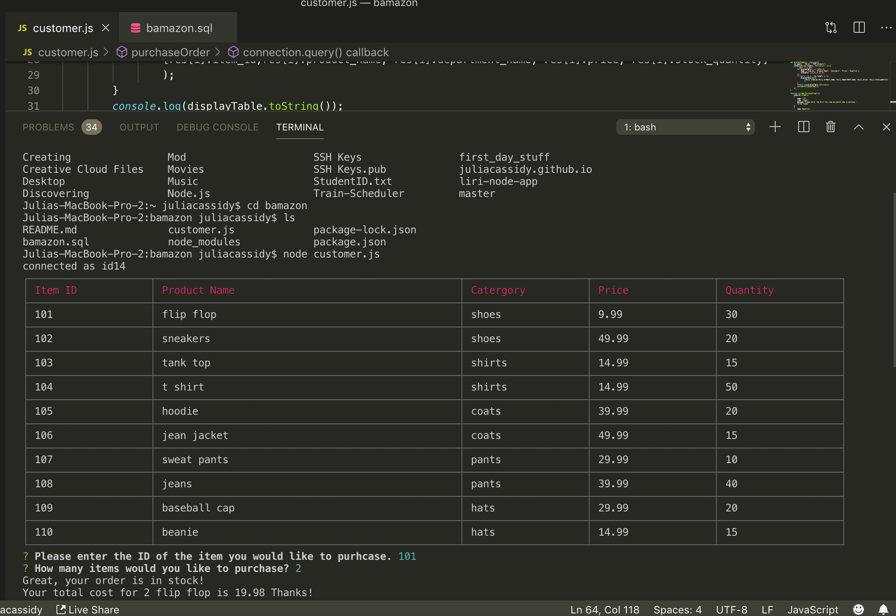
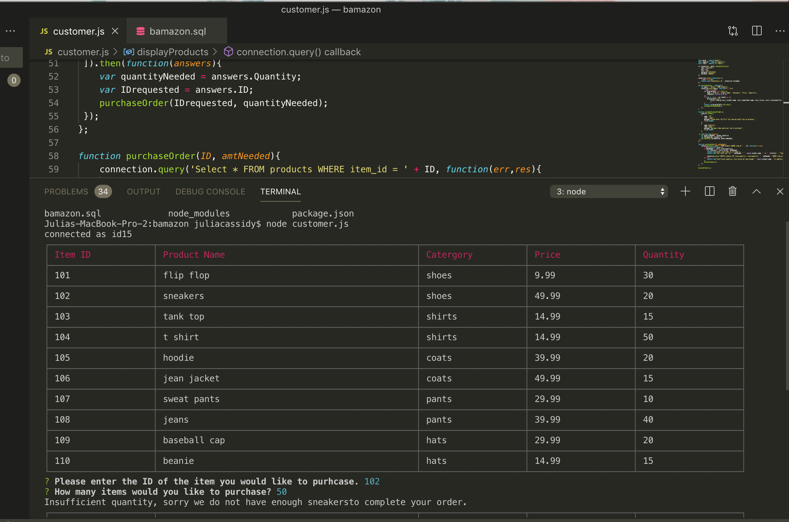
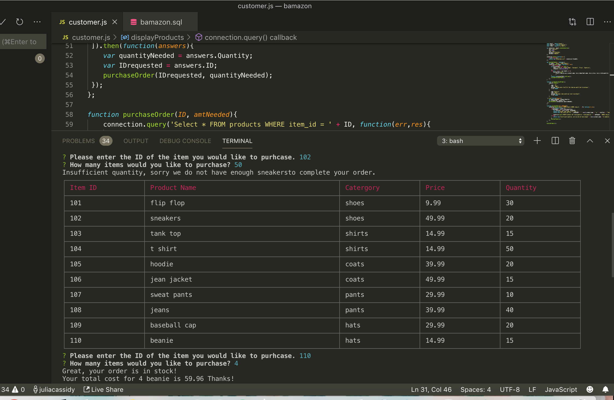

# bamazon

bamazon is a CLI App similar to Amazon. The app allows customers to order from the stores inventory. When the app is opened, a table of inventory appears and the customer is prompted with two questions: which item would you like to order and how much. If the order is able to be completed, it will provide the customer with the total. If there is not enough of the item in stock, the customer will be notified. 

# technologies

Javascript, Node js, CLI, MySQL

# Photos

